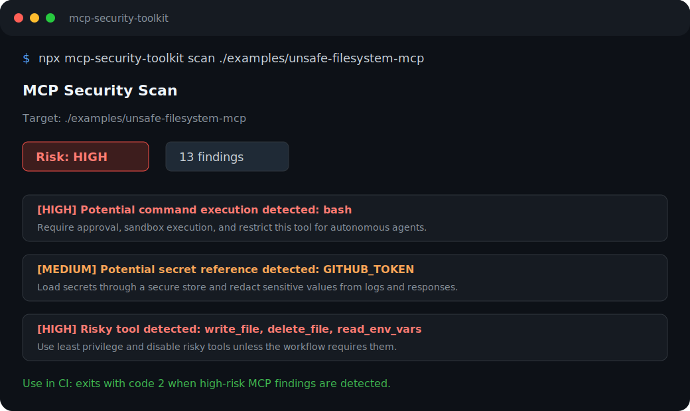

# MCP Security Toolkit

Security scanner and developer toolkit for MCP servers used by Claude, Cursor, Codex, VS Code, and custom AI agents.

[](https://github.com/naveenayalla1-CS50/mcp-security-toolkit/actions/workflows/ci.yml)
[](https://github.com/naveenayalla1-CS50/mcp-security-toolkit/releases)
[](LICENSE)

MCP servers are becoming the tool layer for AI agents. They can expose filesystem access, shell commands, API credentials, database queries, and internal workflows. That power is useful, but it also creates a new security surface.

`mcp-sec` helps developers inspect, test, and harden MCP servers before connecting them to autonomous or semi-autonomous agents.



## Try It

```bash
npx mcp-security-toolkit scan ./my-mcp-server
```

Or run the unsafe example:

```bash
git clone https://github.com/naveenayalla1-CS50/mcp-security-toolkit.git
cd mcp-security-toolkit
npm install
npm run scan:example:unsafe
```

## Why Star This Repo?

- You are building or using MCP servers.
- You connect tools to Claude, Cursor, Codex, VS Code, or custom agents.
- You want a fast check for risky tool access before agent workflows run.
- You care about prompt injection, shell execution, secrets, and filesystem exposure.
- You want a simple open-source project to contribute MCP security rules to.

## Why This Exists

AI agents are no longer just generating text. They can call tools, edit files, run commands, read secrets, create tickets, query databases, and trigger workflows. MCP makes that powerful, but it also creates a new security surface.

`mcp-sec` gives teams a simple first pass for reviewing MCP server configurations and code before they are connected to an agent.

## Example Output

```text
MCP Security Scan
Target: /path/to/mcp-server
Risk level: HIGH
Findings: 8 total, 4 high, 3 medium, 1 low

[HIGH] Potential command execution detected: bash
File: mcp.json
Why: AI-agent tool access to shell commands can execute untrusted instructions or mutate local systems.
Recommendation: Require explicit approval, sandbox execution, and restrict this tool for autonomous agents.
```

## What It Detects

- MCP server configuration files
- Shell or terminal command execution
- Broad filesystem access
- Write/delete-style tools
- Secret and credential references
- Sensitive paths such as `.ssh`, home folders, and cloud credential locations
- Risky tool names such as `exec`, `shell`, `write`, `delete`, `secret`, and `token`

This is not a replacement for a full security review. It is a fast developer-facing check that helps teams catch obvious risks early.

## CLI

```bash
mcp-sec scan .
mcp-sec scan ./examples/unsafe-filesystem-mcp
mcp-sec scan ./mcp.json --json
mcp-sec help
```

The command exits with code `2` when high-risk findings are detected. That makes it usable in CI.

## Supported Targets

`mcp-sec` scans:

- `package.json`
- `.env` and `.env.example`
- `.json`
- `.js`, `.mjs`, `.ts`
- `.yaml`, `.yml`

It skips `node_modules`, `.git`, `dist`, `build`, `coverage`, `.next`, and `.turbo`.

## Example Use Cases

- Review an MCP server before adding it to Claude Desktop.
- Review local agent tools before using them with Cursor or Codex.
- Add a CI check for risky MCP configs.
- Audit demo MCP servers before sharing them publicly.
- Document security posture for internal agent workflows.

## Recommended MCP Security Rules

- Use read-only tools by default.
- Require approval for shell, write, delete, browser automation, and external API actions.
- Scope filesystem access to a dedicated project directory.
- Never return secrets in tool responses.
- Keep tokens out of config files when possible.
- Log tool calls, but redact sensitive data.
- Review prompt-injection paths before exposing private data.

See [docs/mcp-security-checklist.md](docs/mcp-security-checklist.md) for the full checklist.

## Roadmap

- [x] Local scanner CLI
- [x] Text and JSON reports
- [x] Example safe and unsafe MCP configs
- [x] Node test coverage
- [ ] Claude Desktop config auto-discovery
- [ ] Cursor MCP config auto-discovery
- [ ] VS Code MCP config auto-discovery
- [ ] HTML report output
- [ ] SARIF output for GitHub code scanning
- [ ] GitHub Action wrapper
- [ ] Risk policy file support
- [ ] MCP tool schema inspection

## Contributing

Contributions are welcome. Start with a good first issue:

- [Add Claude Desktop config auto-discovery](https://github.com/naveenayalla1-CS50/mcp-security-toolkit/issues/1)
- [Add Cursor MCP config auto-discovery](https://github.com/naveenayalla1-CS50/mcp-security-toolkit/issues/2)
- [Add SARIF output for GitHub code scanning](https://github.com/naveenayalla1-CS50/mcp-security-toolkit/issues/3)
- [Add an HTML security report](https://github.com/naveenayalla1-CS50/mcp-security-toolkit/issues/4)
- [Add more real-world safe/unsafe MCP examples](https://github.com/naveenayalla1-CS50/mcp-security-toolkit/issues/5)

See [CONTRIBUTING.md](CONTRIBUTING.md).

## Disclaimer

This project provides developer-focused security checks for MCP server configurations and code. It does not guarantee that a server is safe. Always perform a full review before connecting MCP servers to sensitive systems, credentials, internal APIs, or autonomous agents.

## License

MIT
